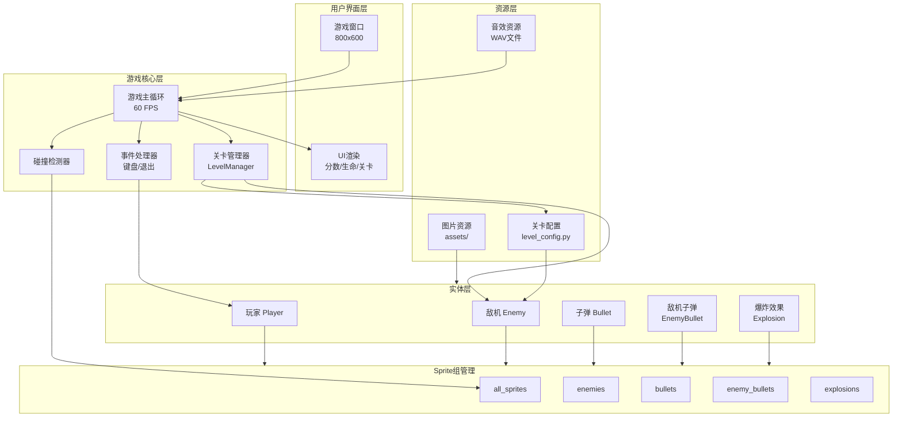
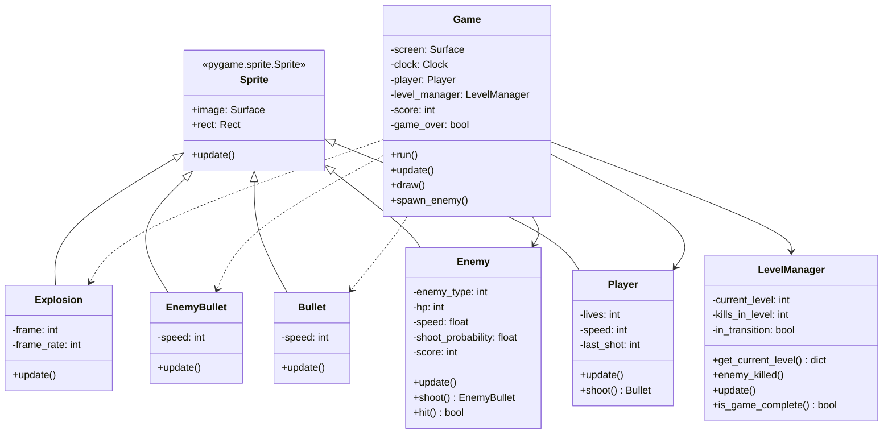
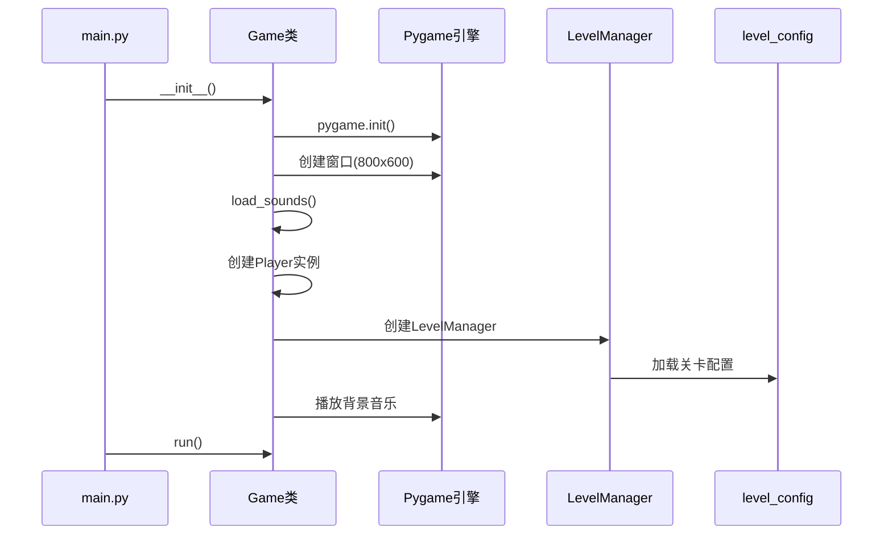
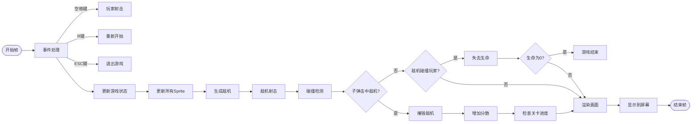
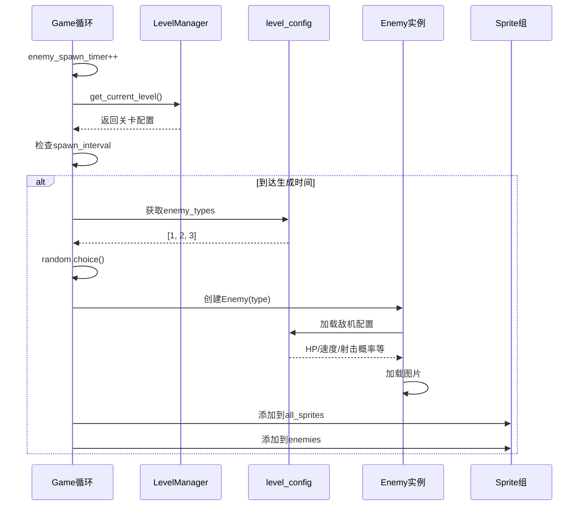
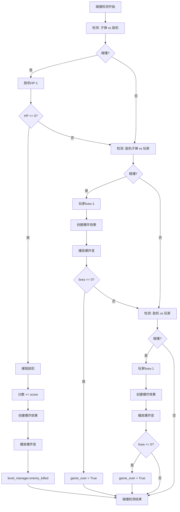
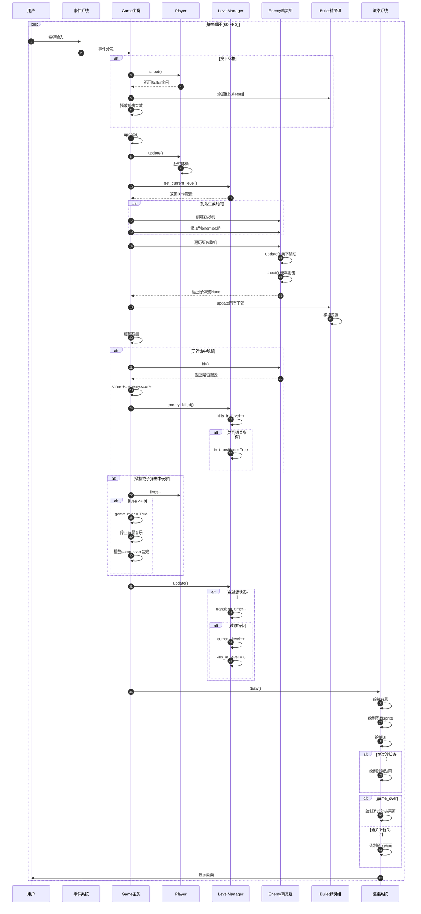

# 打飞机游戏 - 系统架构文档

## 📋 目录

- [系统概述](#系统概述)
- [架构设计](#架构设计)
- [核心模块](#核心模块)
- [数据流转](#数据流转)
- [时序图](#时序图)
- [设计模式](#设计模式)

---

## 系统概述

本游戏采用经典的**游戏循环架构**，基于Pygame框架实现。整体架构遵循**面向对象设计**原则，将游戏实体抽象为独立的类，通过Sprite组管理和更新。

### 核心特点

- **分层架构**: 配置层、实体层、管理层、渲染层
- **事件驱动**: 基于Pygame事件循环
- **组件化设计**: 使用Sprite Group管理游戏对象
- **配置分离**: 关卡和敌机配置独立于游戏逻辑

---

## 架构设计

### 1. 系统架构图



### 2. 类图结构



---

## 核心模块

### 1. Game（游戏主类）

**职责**: 游戏的总控制器，管理游戏循环和所有子系统

**核心属性**:
- `screen`: 游戏窗口
- `player`: 玩家实例
- `level_manager`: 关卡管理器
- `all_sprites`: 所有游戏对象的集合
- 各种Sprite组（enemies, bullets等）

**核心方法**:
- `run()`: 主游戏循环
- `update()`: 更新游戏状态
- `draw()`: 渲染游戏画面
- `spawn_enemy()`: 生成敌机

### 2. LevelManager（关卡管理器）

**职责**: 管理关卡进度、切换和通关判定

**状态机**:
```
正常游戏 → 击败目标数 → 过渡状态 → 下一关 → 正常游戏
                                    ↓
                                  通关
```

**核心属性**:
- `current_level`: 当前关卡索引
- `kills_in_level`: 当前关卡击杀数
- `in_transition`: 是否在过渡动画中

**核心方法**:
- `get_current_level()`: 获取当前关卡配置
- `enemy_killed()`: 处理敌机被击败事件
- `update()`: 更新关卡状态

### 3. Player（玩家类）

**职责**: 玩家飞机的控制和状态管理

**核心属性**:
- `lives`: 生命值（初始3）
- `speed`: 移动速度
- `last_shot`: 上次射击时间（用于冷却）

**核心方法**:
- `update()`: 处理键盘输入，更新位置
- `shoot()`: 发射子弹（带冷却机制）

### 4. Enemy（敌机类）

**职责**: 敌机的行为和属性管理

**核心属性**:
- `enemy_type`: 敌机类型（1-8）
- `hp`: 当前生命值
- `speed`: 移动速度
- `shoot_probability`: 每帧射击概率

**核心方法**:
- `update()`: 向下移动
- `shoot()`: 概率性射击
- `hit()`: 受到伤害，返回是否被摧毁

### 5. Bullet & EnemyBullet（子弹类）

**职责**: 子弹的移动和生命周期管理

**行为**:
- 匀速直线移动
- 离开屏幕自动销毁

### 6. Explosion（爆炸效果类）

**职责**: 爆炸动画的播放

**行为**:
- 帧动画播放（9帧）
- 播放完毕自动销毁

---

## 数据流转

### 1. 游戏初始化流程



### 2. 游戏主循环流程



### 3. 敌机生成流程



### 4. 碰撞检测流程



---

## 时序图

### 完整游戏循环时序图



---

## 设计模式

### 1. 组合模式（Sprite Group）

使用Pygame的Sprite组管理所有游戏对象：

```python
# 统一管理
self.all_sprites = pygame.sprite.Group()
self.enemies = pygame.sprite.Group()
self.bullets = pygame.sprite.Group()

# 统一更新
self.all_sprites.update()

# 统一渲染
self.all_sprites.draw(self.screen)
```

### 2. 工厂模式（敌机创建）

根据配置动态创建不同类型的敌机：

```python
def spawn_enemy(self):
    level = self.level_manager.get_current_level()
    enemy_type = random.choice(level['enemy_types'])
    enemy = Enemy(enemy_type)  # 工厂方法
```

### 3. 状态模式（关卡管理）

关卡管理器维护游戏状态：

```python
class LevelManager:
    - 正常状态: in_transition = False
    - 过渡状态: in_transition = True
    - 通关状态: current_level >= len(LEVELS)
```

### 4. 观察者模式（事件处理）

Pygame事件系统作为发布者，Game类作为订阅者：

```python
for event in pygame.event.get():
    if event.type == pygame.KEYDOWN:
        # 处理事件
```

### 5. 单例模式（Game类）

整个游戏只有一个Game实例控制全局：

```python
if __name__ == '__main__':
    game = Game()  # 唯一实例
    game.run()
```

---

## 配置系统

### 配置分离原则

关卡和敌机配置独立于游戏逻辑：

```python
# level_config.py
ENEMY_TYPES = {1: {...}, 2: {...}, ...}
LEVELS = [{...}, {...}, ...]

# main.py
from level_config import ENEMY_TYPES, LEVELS
```

**优势**:
- 修改游戏难度无需改动代码
- 易于扩展新关卡和敌机
- 数据驱动设计

---

## 性能优化策略

### 1. 对象池（隐式）

Sprite的kill()方法和Group管理实现了对象的自动回收。

### 2. 碰撞检测优化

使用Pygame的内置碰撞检测函数（基于矩形碰撞）：

```python
pygame.sprite.groupcollide()  # 组与组碰撞
pygame.sprite.spritecollide()  # 精灵与组碰撞
```

### 3. 帧率控制

固定60 FPS确保游戏流畅且不占用过多CPU：

```python
self.clock.tick(FPS)  # 限制帧率
```

---

## 扩展性设计

### 易于扩展的部分

1. **新增敌机类型**: 只需在`level_config.py`中添加配置
2. **新增关卡**: 在`LEVELS`列表中添加新配置
3. **新增道具**: 创建新的Sprite类，添加到碰撞检测
4. **新增BOSS战**: 修改关卡配置，添加特殊逻辑

### 扩展示例

添加道具系统：

```python
# 1. 创建道具类
class PowerUp(pygame.sprite.Sprite):
    def __init__(self, x, y, type):
        # 实现道具逻辑
        
# 2. 添加到Game类
self.powerups = pygame.sprite.Group()

# 3. 碰撞检测
hits = pygame.sprite.spritecollide(
    self.player, self.powerups, True
)
```

---

## 总结

本游戏采用**分层架构**和**面向对象设计**，将复杂的游戏逻辑拆分为独立的模块和类。通过**配置分离**实现数据驱动，使用**Sprite组**统一管理游戏对象，通过**事件循环**驱动整个游戏流程。

**核心优势**:
- ✅ 结构清晰，易于理解
- ✅ 模块解耦，易于维护
- ✅ 配置驱动，易于扩展
- ✅ 性能良好，流畅运行

---

**文档版本**: 1.0  
**创建时间**: 2026年2月9日  
**作者**: CodeFlicker AI Assistant
